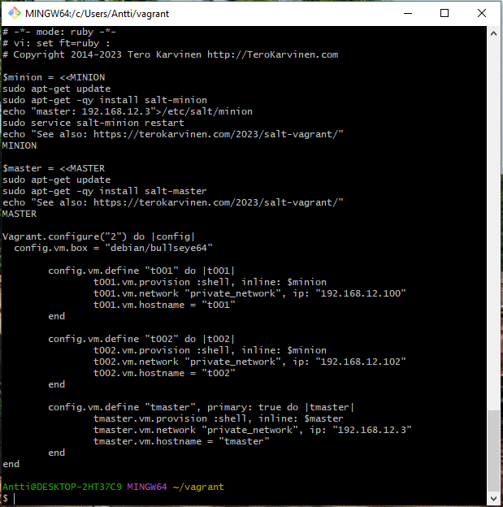
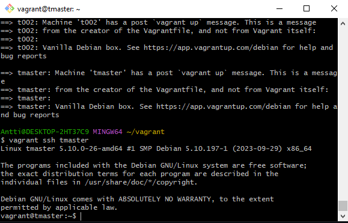

# h2 Karjaa

## x Lue ja tiivistä
- Cattle not pets
  - Ennen palvelimia kohdeltiin kuin lemmikkejä, nimettiin, kaikki tehtiin käsin, jos palvelin kaatui, se piti manuaalisesti korjata välittömästi
  - Nykyään pitäisi kohdella kuin karjaa, numeroida, jos yksi tai useampi kaatuu niin muut palvelimet hoitavat niiden työt, automaattisesti, kaatuneet voi vaikka tuhota jos ei voi korjata helposti
- Vagrant revisited
  - Pikaohjeet miten Vagrant asennetaan Linuxiin ja miten uusi virtuaalikone käynnistetään
- Salt Vagrant
  - Ohjeet yhden masterin ja kahden orjan luomiseen ja tutkimiseen

Tein harjoituksen lauantaina 2023-11-04. Työaseman prosessori: 11th Gen Intel(R) Core(TM) i5-11600K @ 3.90GHz 3.91 GHz, RAM: 16.0 GB, järjestelmä: Windows 10 Pro

### a) - d) Asenna Vagrant - Asenna Saltin herra-orja arkkitehtuuri toimimaan verkon yli.
- Latasin ja asensin Vagrantin (https://developer.hashicorp.com/vagrant/downloads)
- Katsoin lisäohjeita asentamiseen/alkuunpääsyyn täältä (https://developer.hashicorp.com/vagrant/tutorials/getting-started/getting-started-index) ja täältä (https://developer.hashicorp.com/vagrant/docs/installation), sekä täältä (https://sloopstash.com/blog/how-to-build-vm-on-windows-10-using-virtualbox-vagrant-git-bash.html)

Vagrantin asennuksen jälkeen kokeilin aluksi käyttää sitä suoraan Windowsin Command Promptilla.

Käynnistin Vagrantin komennolla vagrant up.

Kokeilin myös SSH:ta. joka toimi, mutta en tehnyt siinä vaiheessa sen enempää.

Nopean uloskirjautumisen jälkeen tuhosin virtuaalikoneen komennolla vagrant destroy.

Tässä välissä latasin ja asensin Git Bashin, jotta voisin kirjoittaa Linuxin komentoja Windowsissa ja tekeminen näyttäisi enemmän siltä kuin ohjeissa, jotka on vain Linuxille. (https://git-scm.com/download/win)(https://sloopstash.com/blog/how-to-build-vm-on-windows-10-using-virtualbox-vagrant-git-bash.html)
Git Bashissa aluksi asetin käyttäjänimen ja sähköpostiosoitteen.

Tarkistin tässä välissä Vagrantin version, joka oli 2.4.0.

Tällä kertaa asensin myös ohjeissa olleen version, joka oli debian/bullseye64. Asennus loi kansioon uuden Vagrantfilen, niin kuin pitikin.

Tämän jälkeen muokkasin Vagrantfilen niiden ohjeiden mukaan, jotka olivat sivulla https://terokarvinen.com/2023/salt-vagrant/. Muokkauksen tein Notepadilla.

VirtualBoxissa myös näkyy uudet juuri luodut virtuaalikoneet.

Tämä ei kuitenkaan riittänyt, sillä taaskaan mikään ei toiminut, kun teki ohjeiden mukaan. vagrant ssh tmaster -komennolla tuloksena oli Permission denied (publickey).

Googlaamalla löytyi lopulta korjaava neuvo, eli lisäämällä Vagrantfileen yhden rivin ongelma korjaantui. Kyseinen rivi oli config.ssh.insert_key = false. Näin päästiin lopulta virtuaaliselle master-koneelle. (https://www.devopsroles.com/vagrant-ssh-permission-denied-fixed/)

### g) Aja shell-komento orjalla verkon yli.
Orjakoneiden avainten hyväksyminen onnistui. Nämä saatiin esille komennolla sudo salt-key -A. Samoin niiden yhteyksien tarkistaminen (sudo salt '*' test.ping) ja shell-komennon ajaminen (sudo salt '*' cmd.run 'hostname -I').

### f) Kerää teknistä tietoa orjista verkon yli (grains.item)
Tietojen hakeminen grains.items sekä grains.item osfinger ipv4.

### e) Aja useita idempotentteja (state.single) komentoja verkon yli.
Niin kuin on ollut aiemmin puhe, idempotentti komento on sellainen, jossa kuvataan haluttu lopputulos. Alla ensimmäisessä kuvassa on tapahtunut yksi muutos, kun komento on suoritettu ensimmäisen kerran. Toisessa kuvassa sen sijaan muutoksien määrä on nolla, koska komennossa mainittu tiedosto on jo olemassa. Näissä käytetty komento oli sudo salt '*' state.single file.managed '/tmp/see-you-at-terokarvinen-com'.

En tiedä pitikö tässä tulostua terse, mutta ainakin tuloste on lyhyempi, kuin edellisellä komennolla. Ja edelleen nolla muutosta.

Seuraavaksi asensin apachen molemmille orjakoneille (sudo salt '*' state.single pkg.installed apache2) sekä varmistin, että daemon pyörii (sudo salt '*' state.single service.running apache2).

Ja sitten varmistin vielä, että apache pyörii (sudo apt-get -y install curl), (curl -s 192.168.12.102|grep title).

Tämän jälkeen pysäytin apachen (sudo salt '*' state.single service.dead apache2), eikä järjestelmä enää löytänyt sitä (curl 192.168.12.102).

Sitten loin uuden käyttäjän terote01 (sudo salt '*' state.single user.present terote01), sekä muokkaisn käyttäjän tietoja (sudo salt '*' state.single user.present terote01 shell="/bin/bash").

Ja lopuksi poistin käyttäjän terote01 (sudo salt '*' state.single user.absent terote01).

### h) Hello, IaC. Tee infraa koodina kirjoittamalla /srv/salt/hello/init.sls.
Infra as code

Kirjoitin tehtävänannon mukaan, mutta en tiedä mitä ja miksi.

Täällä loppupuolella tehtävänannossa ei enää kerrottu miksi mitäkin tehtiin, joten oli vaikea arvata mitä oltiin oikeasti tekemässä. Eli en todella tiedä mitä tässä piti tehdä.

Joten tässä lopputulos.

## References
- Karvinen 2023: Infra as Code 2023 - Palvelinten Hallinta 2023 syksy https://terokarvinen.com/2023/configuration-management-2023-autumn/
- Slater 2017: What is the definition of "cattle not pets"? https://devops.stackexchange.com/questions/653/what-is-the-definition-of-cattle-not-pets#654
- Karvinen 2017: Vagrant Revisited – Install & Boot New Virtual Machine in 31 seconds https://terokarvinen.com/2017/04/11/vagrant-revisited-install-boot-new-virtual-machine-in-31-seconds/
- Karvinen: Salt Vagrant - automatically provision one master and two slaves https://terokarvinen.com/2023/salt-vagrant/
- HashiCorp: Install Vagrant https://developer.hashicorp.com/vagrant/downloads
- HashiCorp: Install Vagrant https://developer.hashicorp.com/vagrant/docs/installation
- HashiCorp: What is Vagrant? https://developer.hashicorp.com/vagrant/tutorials/getting-started/getting-started-index
- Sloopstash: How to build VM on Windows 10 using VirtualBox, Vagrant, and Git Bash? https://sloopstash.com/blog/how-to-build-vm-on-windows-10-using-virtualbox-vagrant-git-bash.html
- Git-scm.com: Download for windows https://git-scm.com/download/win
- Dr. HuuPV: vagrant ssh Permission denied fixed https://www.devopsroles.com/vagrant-ssh-permission-denied-fixed/
