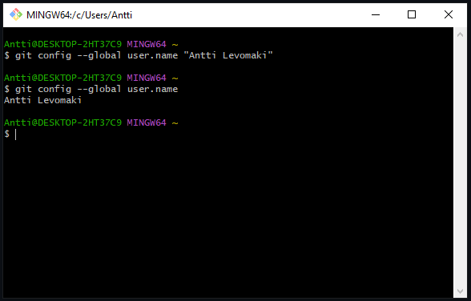

# h2 Karjaa

## x Lue ja tiivistä
- Cattle not pets
  - Ennen palvelimia kohdeltiin kuin lemmikkejä, nimettiin, kaikki tehtiin käsin, jos palvelin kaatui, se piti manuaalisesti korjata välittömästi
  - Nykyään pitäisi kohdella kuin karjaa, numeroida, jos yksi tai useampi kaatuu niin muut palvelimet hoitavat niiden työt, automaattisesti, kaatuneet voi vaikka tuhota jos ei voi korjata helposti
- Vagrant revisited
  - Pikaohjeet miten Vagrant asennetaan Linuxiin ja miten uusi virtuaalikone käynnistetään
- Salt Vagrant
  - Ohjeet yhden masterin ja kahden orjan luomiseen ja tutkimiseen

Tein harjoituksen lauantaina 2023-11-04. Työaseman prosessori: 11th Gen Intel(R) Core(TM) i5-11600K @ 3.90GHz 3.91 GHz, RAM: 16.0 GB, järjestelmä: Windows 10 Pro

### 1) Asenna Vagrant
- Latasin ja asensin Vagrantin (https://developer.hashicorp.com/vagrant/downloads) sekä Git Bashin (https://git-scm.com/download/win)
- Katsoin lisäohjeita asentamiseen/alkuunpääsyyn täältä (https://developer.hashicorp.com/vagrant/tutorials/getting-started/getting-started-index) ja täältä (https://developer.hashicorp.com/vagrant/docs/installation), sekä täältä (https://sloopstash.com/blog/how-to-build-vm-on-windows-10-using-virtualbox-vagrant-git-bash.html)

Vagrantin asennuksen jälkeen kokeilin aluksi käyttää sitä suoraan Windowsin Command Promptilla.

Käynnistin Vagrantin komennolla vagrant up.

Kokeilin myös SSH:ta. joka toimi, mutta en tehnyt siinä vaiheessa sen enempää.

Nopean uloskirjautumisen jälkeen tuhosin virtuaalikoneen komennolla vagrant destroy.

## References
Karvinen 2023: Infra as Code 2023 - Palvelinten Hallinta 2023 syksy https://terokarvinen.com/2023/configuration-management-2023-autumn/
Slater 2017: What is the definition of "cattle not pets"? https://devops.stackexchange.com/questions/653/what-is-the-definition-of-cattle-not-pets#654
Karvinen 2017: Vagrant Revisited – Install & Boot New Virtual Machine in 31 seconds https://terokarvinen.com/2017/04/11/vagrant-revisited-install-boot-new-virtual-machine-in-31-seconds/
Karvinen: Salt Vagrant - automatically provision one master and two slaves https://terokarvinen.com/2023/salt-vagrant/
HashiCorp: Install Vagrant https://developer.hashicorp.com/vagrant/downloads
HashiCorp: Install Vagrant https://developer.hashicorp.com/vagrant/docs/installation
HashiCorp: What is Vagrant? https://developer.hashicorp.com/vagrant/tutorials/getting-started/getting-started-index
Sloopstash: How to build VM on Windows 10 using VirtualBox, Vagrant, and Git Bash? https://sloopstash.com/blog/how-to-build-vm-on-windows-10-using-virtualbox-vagrant-git-bash.html
Git-scm.com: Download for windows https://git-scm.com/download/win
