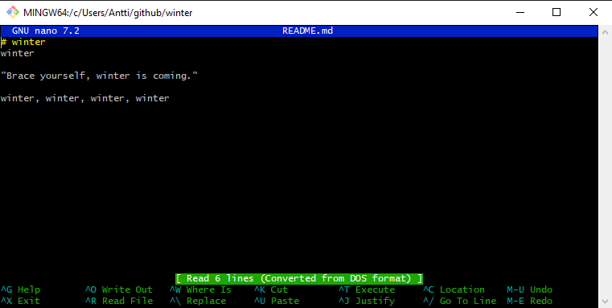

# h3 Versio

Tein harjoituksen 2023-11-11. Työaseman prosessori: 11th Gen Intel(R) Core(TM) i5-11600K @ 3.90GHz 3.91 GHz, RAM: 16.0 GB, järjestelmä: Windows 10 Pro

### a) Online
Aluksi tein uuden varaston Githubiin Tero Karvisen ohjeilla. (https://terokarvinen.com/2023/create-a-web-page-using-github/) Annoin varastolle nimen winter. Lisäsin samalla myös readme-tiedoston sekä GNU General Public License 3 -lisenssin.

### b) Dolly
Avasin omalla koneella GitBashin ja loin uuden kansion nimellä github, jonne kloonaan winter-varaston Githubista. (Github 2023)

Varmistin Githubin ohjeiden mukaan, että omalla koneella ei ole ennenstään ssh-avainta. (Github 2023)

Tämän jälkeen loin ssh-avaimen Githubin ohjeiden mukaan. (https://docs.github.com/en/authentication/connecting-to-github-with-ssh/generating-a-new-ssh-key-and-adding-it-to-the-ssh-agent)

Sitten kopioin ssh-avaimen leikepöydälle...

...ja loin Githubissa uuden ssh-avainparin...

sekä authentication-, että signing-avaimeksi. (https://docs.github.com/en/authentication/connecting-to-github-with-ssh/adding-a-new-ssh-key-to-your-github-account)

Kloonausta varten kävin kopioimassa Githubista winter-varaston osoitteen.

Gitbashilla kloonasin varaston omalle koneelle.

Tein nanolla muutoksia readme-tiedostoon.

## References
- Karvinen 2023: Infra as Code 2023 - Palvelinten Hallinta 2023 syksy https://terokarvinen.com/2023/configuration-management-2023-autumn/
- Karvinen 2023: Create a Web Page Using Github https://terokarvinen.com/2023/create-a-web-page-using-github/
- Github 2023: Cloning a repository  https://docs.github.com/en/repositories/creating-and-managing-repositories/cloning-a-repository
- Github 2023: Checking for existing SSH keys https://docs.github.com/en/authentication/connecting-to-github-with-ssh/checking-for-existing-ssh-keys
- Github 2023: Generating a new SSH key and adding it to the ssh-agent https://docs.github.com/en/authentication/connecting-to-github-with-ssh/generating-a-new-ssh-key-and-adding-it-to-the-ssh-agent
- Github 2023: Adding a new SSH key to your GitHub account https://docs.github.com/en/authentication/connecting-to-github-with-ssh/adding-a-new-ssh-key-to-your-github-account
