# h4 Demonit

Tein harjoituksen 2023-11-20. Työaseman prosessori: 11th Gen Intel(R) Core(TM) i5-11600K @ 3.90GHz 3.91 GHz, RAM: 16.0 GB, järjestelmä: Windows 10 Pro, Linux-komentojen käyttöön Git Bash

### x) Lue ja tiivistä
  - Salt Vagrant
    - YAML:ssa sisennyksellä on merkitystä, ja se on kaksi välilyöntiä
    - top-tiedosto määrittää, mitä tiloja ajetaan millekin orjalle
   
  - Salt overview
    - YAML on merkintäkieli, jonka tehtävänä on ottaa YAML-tietorakenne ja kääntää se Python-tietorakenteeksi Saltille
    - YAML:n kolme perustyyppiä ovat scalar, list ja dictionary
    - YAML on järjestetty lohkorakenteiksi
   
  - Salt states
    - Salt state ei vaadi tarkistusta, koska install state tarkistaa implisiittisesti paketin järjestelmän paketinhallinnasta
    - Tilatiedoston tilan määritelmässä on seuraavat osat: identifier, state, function, name, arguments
    - State treen salt states tulee kirjoittaa niin, että toinen kehittäjä voi nopeasti todeta salt states tarkoituksen
    - Koska joissakin ympäristöissä on satoja tilatiedostoja, jotka on kohdistettu tuhansiin orjiin, ei ole käytännöllistä ajaa jokaista tilaa erikseen ja kohdistaa sitten soveltuviin orjiin joka kerta
    - Itse asia tilan id:ksi, name arvoksi tulee automaattisesti sama

  - Pkg-File-Service
    - Näytetään, miten Saltin tiloilla voidaan määritellä SSHd konfiguraatiota
    - Vaihdetaan kuunneltava portti

### a) Hello SLS!

Omalla koneella oli vielä vanha vagrantfile aiemmasta, tehtävästä, mutta kyseiset virtuaalikoneet olin tuhonnut tehtävän lopuksi, joten uudet virtuaalikoneet luontiin komennolla vagrant up -komennolla. Yksi master ja kaksi minionia, Tero Karvisen ohjeiden mukaan (https://terokarvinen.com/2023/salt-vagrant/).

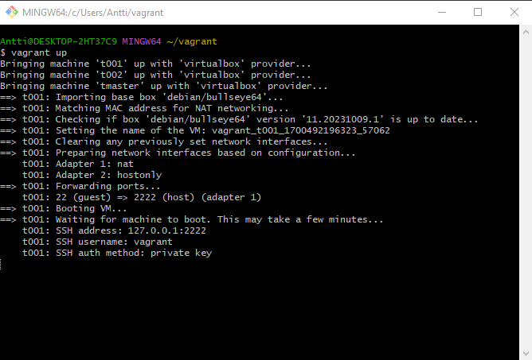

Komennolla vagrant ssh tmaster kirjauduin virtuaalikoneelle ja sain minionien odottavat avaimet näkyviin komennolla sudo salt-key -A.
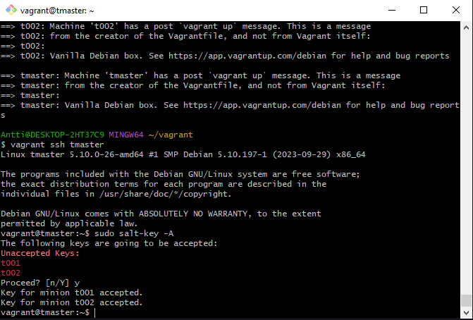

Tein hello-kansion ja sine init.sls-tiedoston, jonne laitoin alla olevan tekstin.
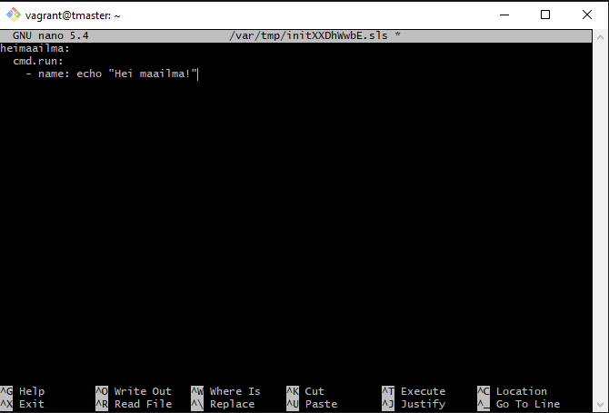

Testasin myös, että yhteydet toimivat minioneihin.
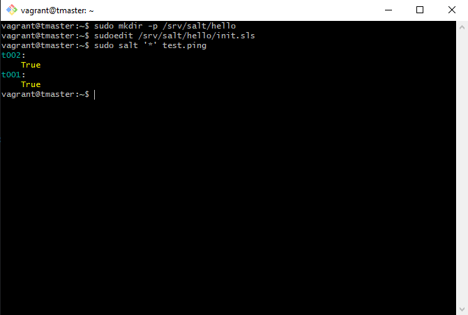

Ja kuten alla näkyy, "Hei maailma". Komennolla sudo salt '*' state.apply hello
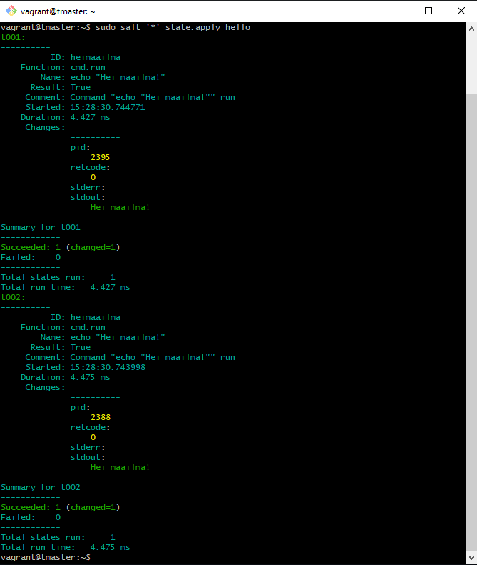

### b) Top

top.sls-tiedoston luonti komennolla sudoedit /srv/salt/top.sls (https://terokarvinen.com/2023/salt-vagrant/)
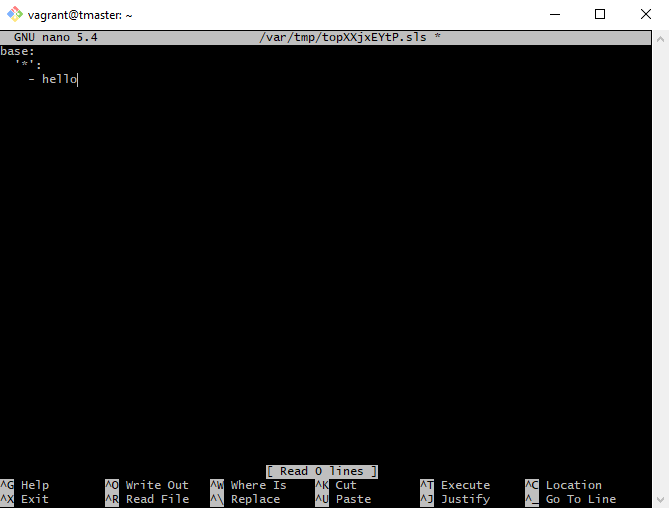

Näin saatiin tilat ajettua automaattisesti ilman, erillistä määrittelyä.
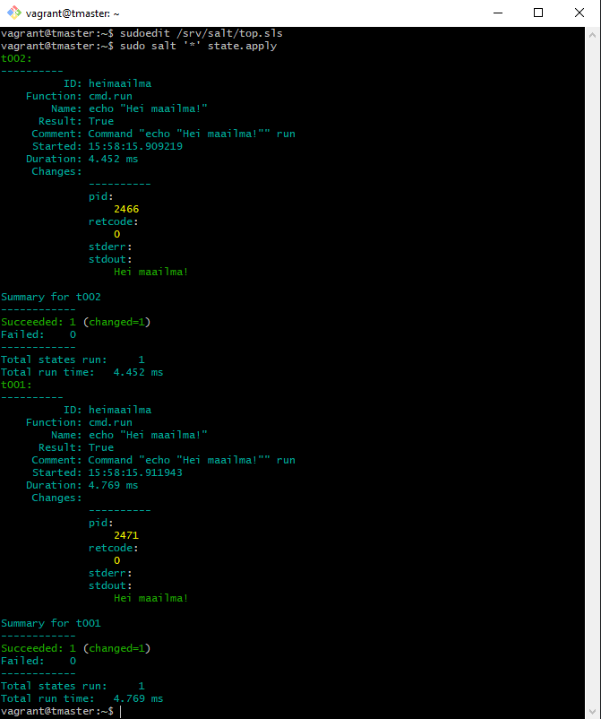

### c) Apache

Aluksi asensin käsin apachen minionille.

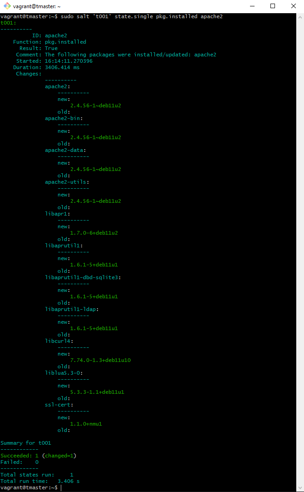

Ja sitten poistin sen käsin.

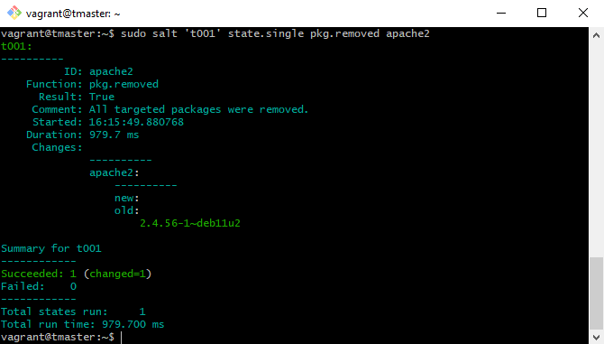

Sitten tein sls-tiedoston Tero Karvisen ohjeiden mukaan. (https://terokarvinen.com/2018/apache-user-homepages-automatically-salt-package-file-service-example/)

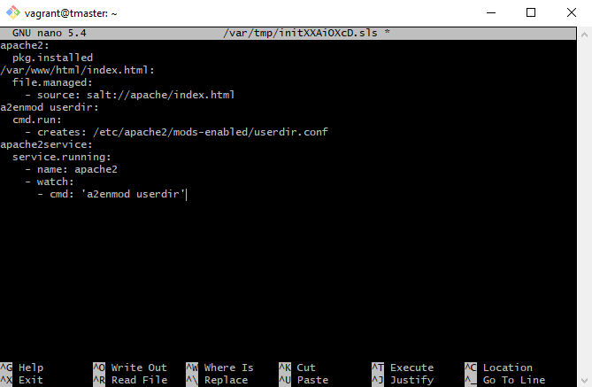

Ensimmäisellä yrityksellä tuli virheilmoitus, joka johtui kirjoitusvirheestä, mutta kun poistin numeron 2 sanan apache lopusta ja ajoin komennon uudestaan, se lähti pyörimään.

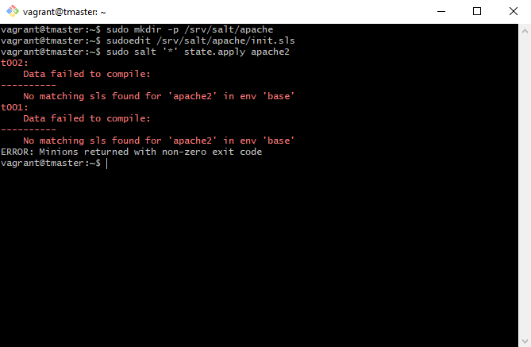

Ilo oli osittain lyhytaikainen, sillä vaikka suurin osa asennuksista onnistui, yksi ei mennyt läpi.

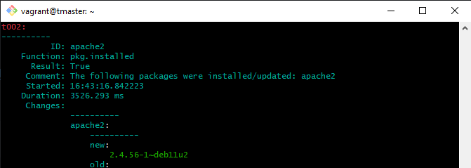

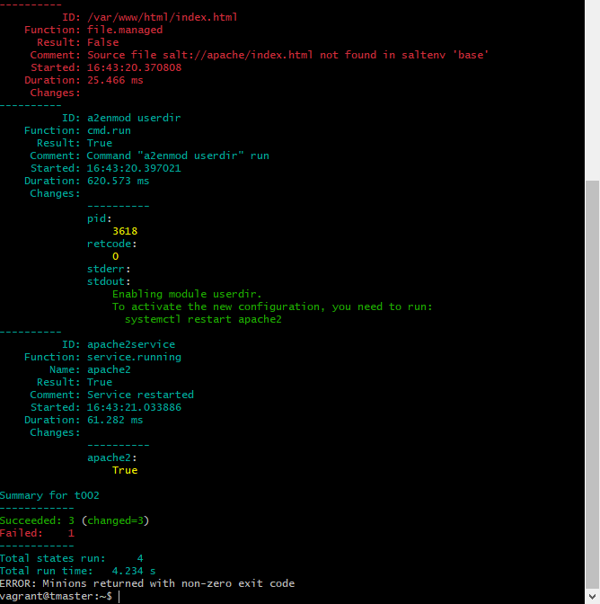

### d) SSHouto

Ohjeiden mukaan yritin tehdä tämän virtuaalikoneella, eli VirtualBoxissa Debianilla, enkä omalla koneella.
Aluksi loin komentorivillä tarvittavat tiedostot, joista ensimmäinen oli sshd.sls.

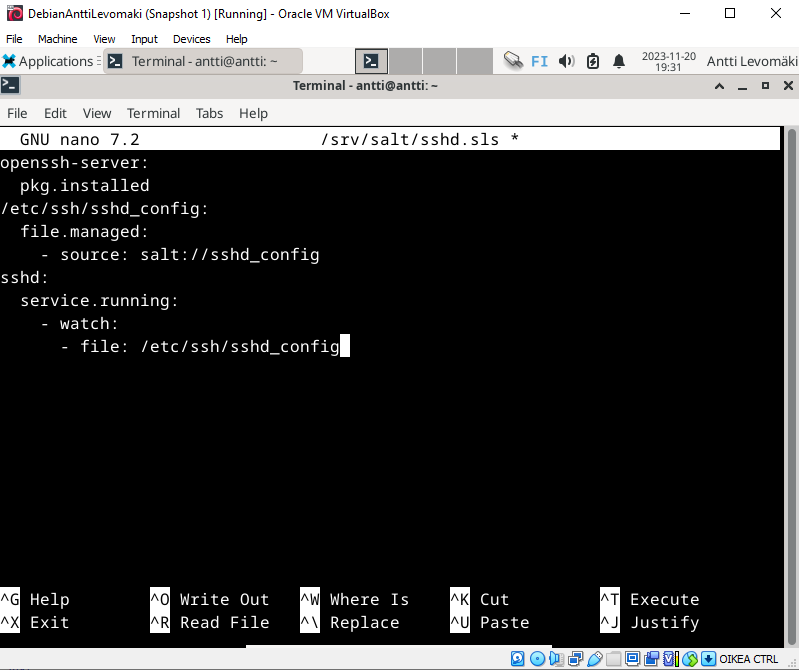

Toinen tiedosto oli sshd_config. Molemmat tein Tero Karvisen ohjeilla. (https://terokarvinen.com/2018/04/03/pkg-file-service-control-daemons-with-salt-change-ssh-server-port/?fromSearch=karvinen%20salt%20ssh)
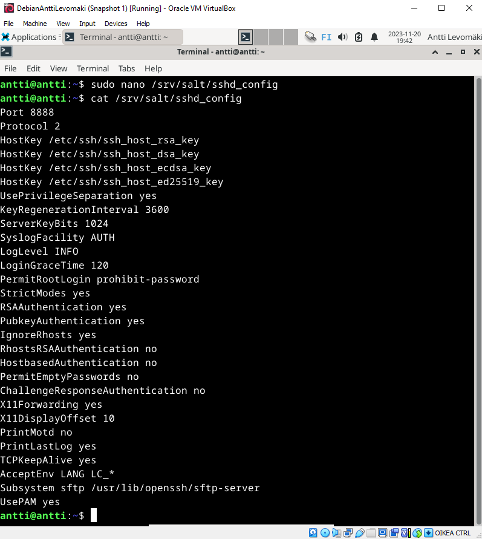

## References
- Karvinen 2023: Infra as Code 2023 - Palvelinten Hallinta 2023 syksy https://terokarvinen.com/2023/configuration-management-2023-autumn/
- Karvinen 2023: Salt Vagrant - automatically provision one master and two slaves https://terokarvinen.com/2023/salt-vagrant/#infra-as-code---your-wishes-as-a-text-file
- VMware, Inc. 2023: Salt overview https://docs.saltproject.io/salt/user-guide/en/latest/topics/overview.html#rules-of-yaml
- VMware, Inc. 2023: Salt states https://docs.saltproject.io/salt/user-guide/en/latest/topics/states.html#state-modules
- Karvinen 2018: Pkg-File-Service – Control Daemons with Salt – Change SSH Server Port https://terokarvinen.com/2018/04/03/pkg-file-service-control-daemons-with-salt-change-ssh-server-port/?fromSearch=karvinen%20salt%20ssh
- Karvinen 2023: Salt Vagrant - automatically provision one master and two slaves https://terokarvinen.com/2023/salt-vagrant/
- Karvinen 2018: Apache User Homepages Automatically – Salt Package-File-Service Example https://terokarvinen.com/2018/apache-user-homepages-automatically-salt-package-file-service-example/
- Karvinen 2018: Pkg-File-Service – Control Daemons with Salt – Change SSH Server Port https://terokarvinen.com/2018/04/03/pkg-file-service-control-daemons-with-salt-change-ssh-server-port/?fromSearch=karvinen%20salt%20ssh
