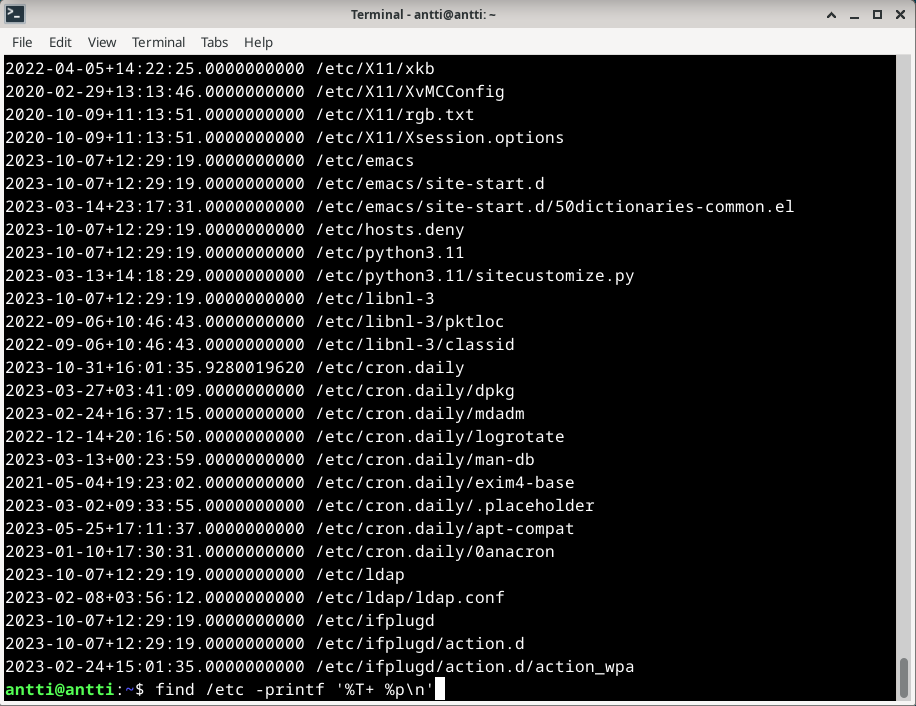
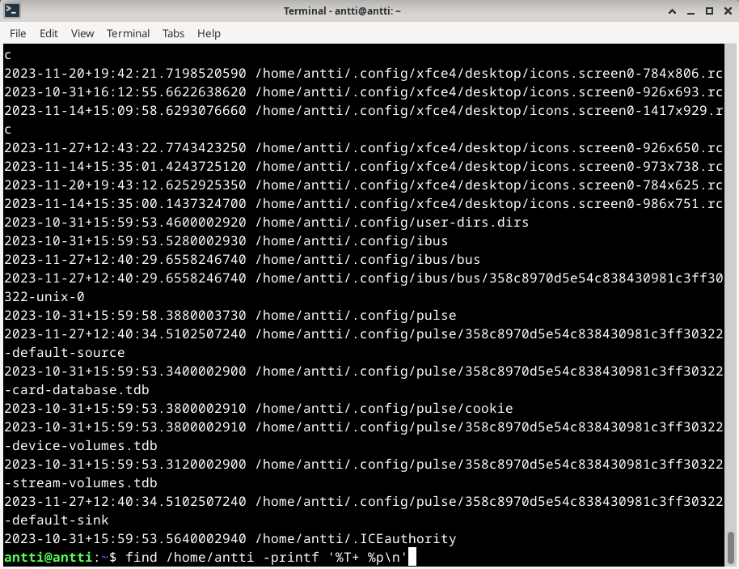

# h5 CSI Kerava

Tein harjoituksen 2023-11-26. Työaseman prosessori: 11th Gen Intel(R) Core(TM) i5-11600K @ 3.90GHz 3.91 GHz, RAM: 16.0 GB, järjestelmä: Windows 10 Pro, Linux-komentojen käyttöön Git Bash

### x) Lue ja tiivistä
  - Apache User Homepages Automatically
    - Asenna ensin manuaalisesti, automatisointi vasta sen jälkeen.
    - $ find -printf "%T+ %p\n"|sort
      - "%T+" on muokkausaika
      - "%p" on tiedostonimi ja polku
      - "\n" on uusi rivi
    - Komennosta pitää tehdä idempotentti.

# a) CSI Kerava

## References
- Karvinen 2023: Infra as Code 2023 - Palvelinten Hallinta 2023 syksy https://terokarvinen.com/2023/configuration-management-2023-autumn/
- Karvinen 2018: Apache User Homepages Automatically https://terokarvinen.com/2018/04/03/apache-user-homepages-automatically-salt-package-file-service-example/
