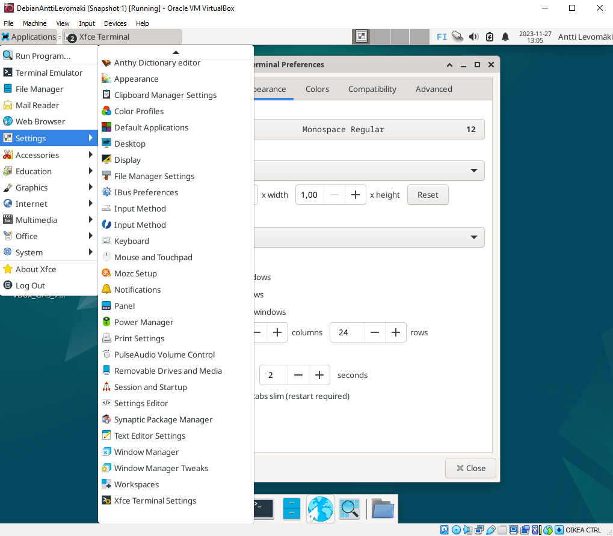
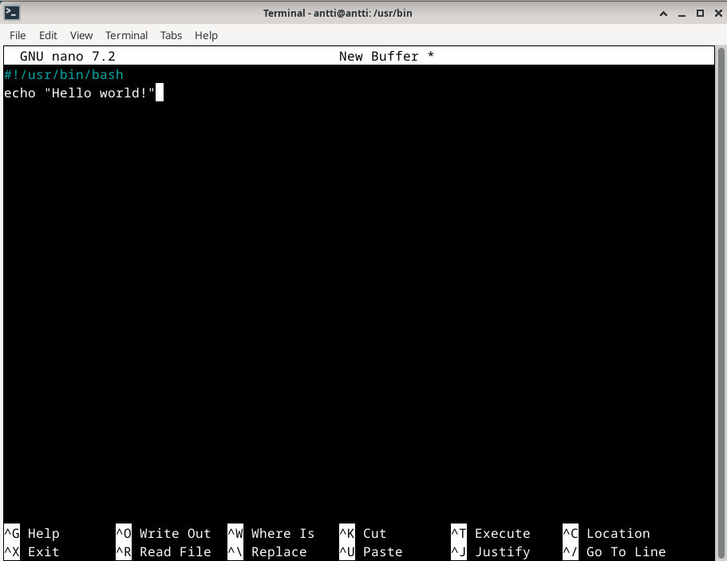
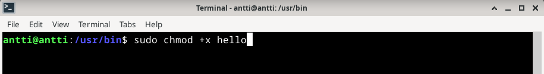
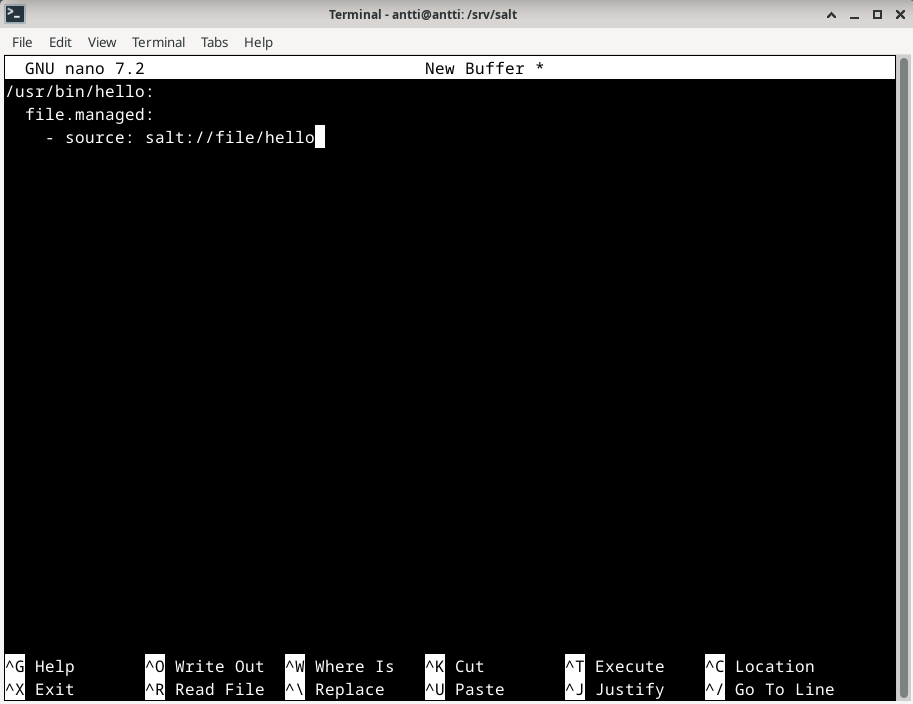
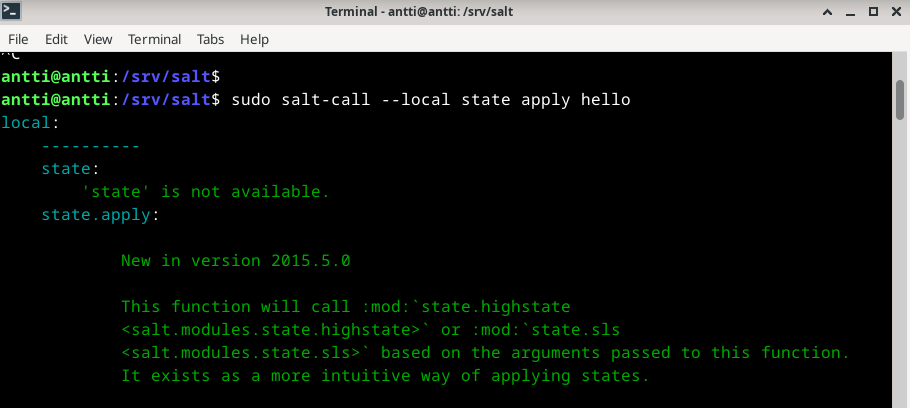
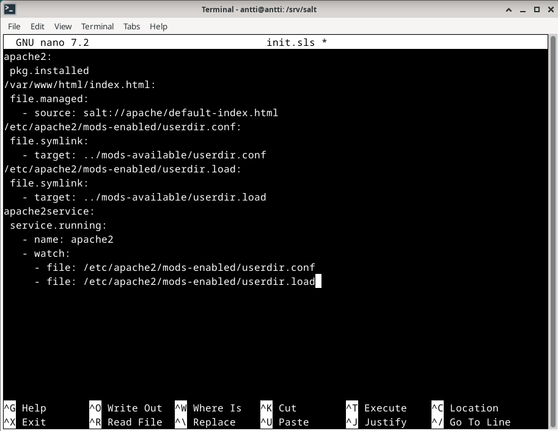
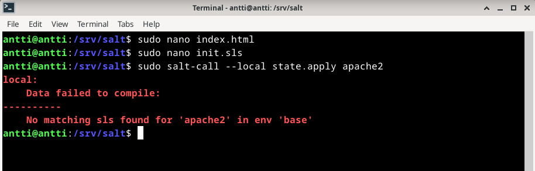

# h5 CSI Kerava

Tein harjoituksen 2023-11-27. Työaseman prosessori: 11th Gen Intel(R) Core(TM) i5-11600K @ 3.90GHz 3.91 GHz, RAM: 16.0 GB, järjestelmä: Windows 10 Pro, Oracle VM VirtualBox, Debian

### x) Lue ja tiivistä
  - Apache User Homepages Automatically
    - Asenna ensin manuaalisesti, automatisointi vasta sen jälkeen.
    - $ find -printf "%T+ %p\n"|sort
      - "%T+" on muokkausaika
      - "%p" on tiedostonimi ja polku
      - "\n" on uusi rivi
    - Komennosta pitää tehdä idempotentti.

# a) CSI Kerava

Käytin Tero Karvisen vinkkiä (https://terokarvinen.com/2023/configuration-management-2023-autumn/) eli komentoa "find -printf '%T+ %p\n'". Tähän komentoon lisäsin ensin /etc ja toiseen /home/antti.

# b) Gui2fs

Yritin muokata terminaalin fontin kokoa, mutta ei tuntunut toimivan.

# c) Komennus

Tein aluksi hello worldin ja annoin sille execute-oikeudet.

Sitten tein sille sls-tiedoston.

Toteutus ei kuitenkaan onnistunut, eikä ollut aikaa alkaa korjaamaan.

# d) Apassi

Yritin tehdä html-tiedoston sekä init-tiedoston Tero Karvisen ohjeiden mukaan (https://terokarvinen.com/2018/04/03/apache-user-homepages-automatically-salt-package-file-service-example/).

Loppuun asti ei kuitenkaan päästy, eikä ollut aikaa korjata ennen palautuksen deadlinea.

# e) Ämpärillinen

Tähänkin pitää palata myöhemmin. Turha tehdä vain jotain, kun edellisetkään eivät toimineet.

## References
- Karvinen 2023: Infra as Code 2023 - Palvelinten Hallinta 2023 syksy https://terokarvinen.com/2023/configuration-management-2023-autumn/
- Karvinen 2018: Apache User Homepages Automatically https://terokarvinen.com/2018/04/03/apache-user-homepages-automatically-salt-package-file-service-example/
- Karvinen 2018: Apache User Homepages Automatically – Salt Package-File-Service Example https://terokarvinen.com/2018/04/03/apache-user-homepages-automatically-salt-package-file-service-example/
- Karppinen 2023: h5 Kerava https://github.com/SakuKarp/Palvelinten.Hallinta/blob/main/h5%20Kerava.md
