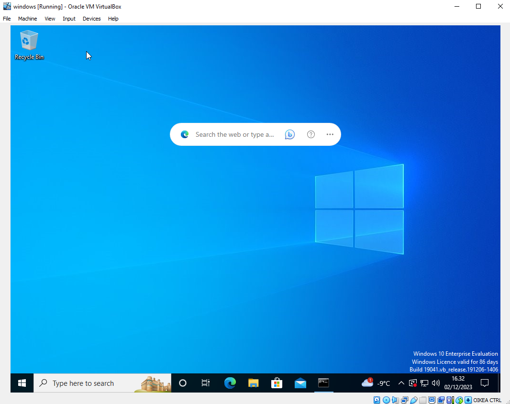
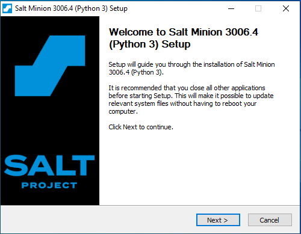
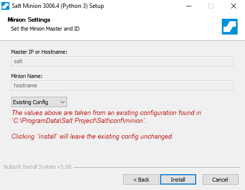
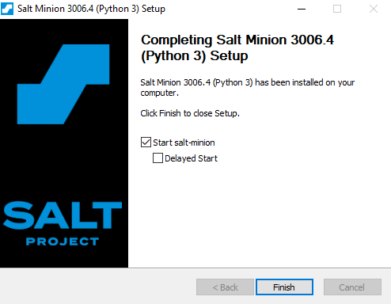
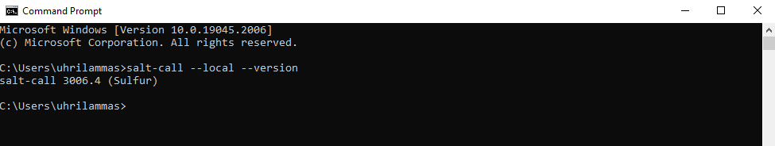

# h6 Windows

Tein harjoituksen 2023-12-02. Työaseman prosessori: 11th Gen Intel(R) Core(TM) i5-11600K @ 3.90GHz 3.91 GHz, RAM: 16.0 GB, järjestelmä: Windows 10 Pro, Oracle VM VirtualBox,

### x) Lue ja tiivistä
  - Vapaavalintainen aiemman vuoden kotitehtäväraportti Saltin käytöstä Windowsilla
    - Windows as Salt-minion – homework 5 (Kunnari)
    - Salt-minionin asennus windowsille
    - pkg.installed
    - state.apply
  - Installing Windows 10 on a virtual machine
    - Lataa windows10-iso-tiedosto
    - Luo VirtualBoxissa uusi virtuaalikone ja asenna siihen äsken ladattu iso-tiedosto
    - Valitse oikeat näppäimistö- kieli- ym. valinnat
  - Filesystem Hierarchy Standard
    - root - juuri
    - /bin - sisältää komentoja, joita sekä sysadmin että käyttäjät voivat käyttää
    - /etc - sisältää asetustiedostoja (configuration files). "Asetustiedosto" on paikallinen tiedosto, jota käytetään ohjaamaan ohjelman toimintaa
    - /home - käyttäjän kotihakemisto
    - /srv - sisältää sivustokohtaisia tietoja, joita tämä järjestelmä palvelee
    - /tmp - hakemiston on oltava käytettävissä ohjelmille, jotka vaativat väliaikaisia tiedostoja
    - /usr - on tiedostojärjestelmän toinen tärkeä osa. /usr on jaettavaa, read-only dataa
    - /var - sisältää muuttuvia datatiedostoja

## a) Asenna Windows virtuaalikoneeseen.

Asensin windowsin uuteen virtuaalikoneeseen VirtualBoxissa tämän ohjeen mukaan. (https://github.com/therealhalonen/PhishSticks/blob/master/notes/ollikainen/windows.md)
Tämä tehtiin jo tunnilla, joten siitä ei tullut otettua screenshotteja eri vaiheista. Alla kuitenkin kuva käynnissä olevasta virtuaalikoneesta.

## b) Asenna Salt Windowsille.

Latasin ja asensin saltin virtuaalikoneelle osoitteesta https://docs.saltproject.io/salt/install-guide/en/latest/topics/install-by-operating-system/windows.html.

Olin ilmeisesti jo tehnyt tämänkin tunnilla, mutta asensin sen silti uudelleen. Asennuksen aikana tuli siihen liittyen myös tällainen ilmoitus.

Asennus tuli valmiiksi ja laitoin saltin käynnistymään heti.

Komennolla "salt-call --local --version" saatiin saltin versio, joten asennuksen pitäisi olla onnistunut.

   

## References
- Karvinen 2023: Infra as Code 2023 - Palvelinten Hallinta 2023 syksy https://terokarvinen.com/2023/configuration-management-2023-autumn/
- Kunnari 2019: Windows as Salt-minion – homework 5 https://irenekunnari.wordpress.com/2019/05/01/windows-as-salt-minion/
- Halonen, Rajala, Ollikainen 2023: Installing Windows 10 on a virtual machine https://github.com/therealhalonen/PhishSticks/blob/master/notes/ollikainen/windows.md
- The Linux Foundation 2015: Filesystem Hierarchy Standard https://refspecs.linuxfoundation.org/FHS_3.0/fhs/index.html
- Salt Project 2023: Windows - Salt installguide https://docs.saltproject.io/salt/install-guide/en/latest/topics/install-by-operating-system/windows.html
