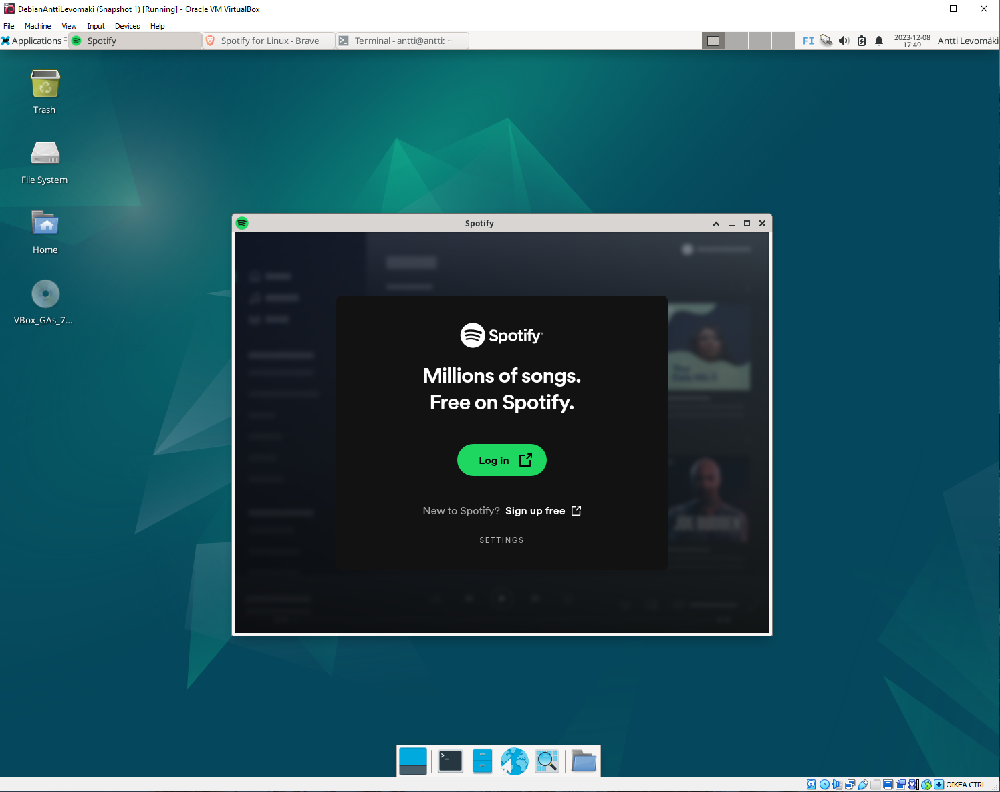

# h7 Omat modulit

Tein harjoituksen 2023-12-09. Työaseman prosessori: 11th Gen Intel(R) Core(TM) i5-11600K @ 3.90GHz 3.91 GHz, RAM: 16.0 GB, järjestelmä: Windows 10 Pro, Oracle VM VirtualBox, Debian GNU/Linux 12 (bookworm)

## Modulin tarkoitus

Tässä harjoituksessa on tarkoituksena asentaa Linuxille sovelluksia, joita käytän Windowsilla ja katsoa miten se onnistuu. Inspiraation moduliin sain aiemmin kurssille osallistuneiden raporteilta, etenkin Oliver ja Justus.

### Brave

Brave on verkkoselain. Kuulopuheiden perusteella se on ainakin turvallisempi, kuin muut yleisesti käytössä olevat selaimet ja se on myös selkeästi kevyempi, kuin esim. Chrome. (Oman kokemuksen perusteella sillä saa myös skipattua mainokset Youtubessa ilman erillisiä adblockereita jne., myös Youtuben uuden adblocker-kiellon jälkeen.)
Braven Linuxille asentamiseen ohjeet löysin Braven sivuilta. (https://brave.com/linux/) Laitoin alla olevat komennot Linuxin komentoriville.

Asennus onnistui ja Brave löytyy Linuxin sovellusvalikosta ja aukeaa käyttöön normaalisti.

### Visual Studio Code

Visual Studio Code on ohjelmoijille tarkoitettu tekstieditori. Ohjeet tämän asentamiseen löysin Visual Studio Coden sivuilta. (https://code.visualstudio.com/docs/setup/linux) Laitoin nämä alla olevat komennot Linuxin komentoriville.

Asennus onnistui ja Visual Studio Code löytyy Linuxin sovellusvalikosta ja aukeaa käyttöön normaalisti.

### Spotify

Spotify on musiikin striimauspalvelu. Ohjeet sen asentamiseen löysin Spotifyn sivuilta. (https://www.spotify.com/us/download/linux/) Laitoin nämä alla olevat komennot Linuxin komentoriville.

Asennus onnistui ja Spotify löytyy Linuxin sovellusvalikosta ja aukeaa käyttöön normaalisti.

### Asennuksen automatisointi

Kaikkien kolmen ohjelman asennus onnistui siis manuaalisesti. Seuraavaksi oli tarkoitus saada se toteutettua yhdellä komennolla. Tämä oli kutenkin vaikeampaa, kuin piti.
Aloitin hakemalla spotifyn avaimen.

Kopioin tiedostoja oikeaan paikkaan.

Alla ensimmäinen versio init.sls -tiedostosta, jossa tässä vaiheessa vain spotify.

Tiedoston ajaminen ei kuitenkaan onnistunut, kuten alla olevasta kuvasta näkyy.

Varmistin, että salt master ja minion on virtuaalikoneelle asennettu ja näin olikin, mutta siitä huolimatta ei toimi.

Tiedoston ajaminen ei onnistunut virtuaalikoneella myöskään paikallisesti.

## References
- Karvinen 2023: Infra as Code 2023 - Palvelinten Hallinta 2023 syksy https://terokarvinen.com/2023/configuration-management-2023-autumn/
- Santasalo 2022: Project: Learning the basic's https://github.com/ball1n/laskyt/blob/main/Project:%20Learning%20the%20basic's.md
- Justus 2021: Harjoitus 7 https://github.com/Justus-stack/h7_moduli/blob/main/report.md
- Brave 2023: Installing Brave on Linux https://brave.com/linux/
- Microsoft 2023: Visual Studio Code on Linux https://code.visualstudio.com/docs/setup/linux
- Spotify 2023: Spotify for Linux https://www.spotify.com/us/download/linux/
